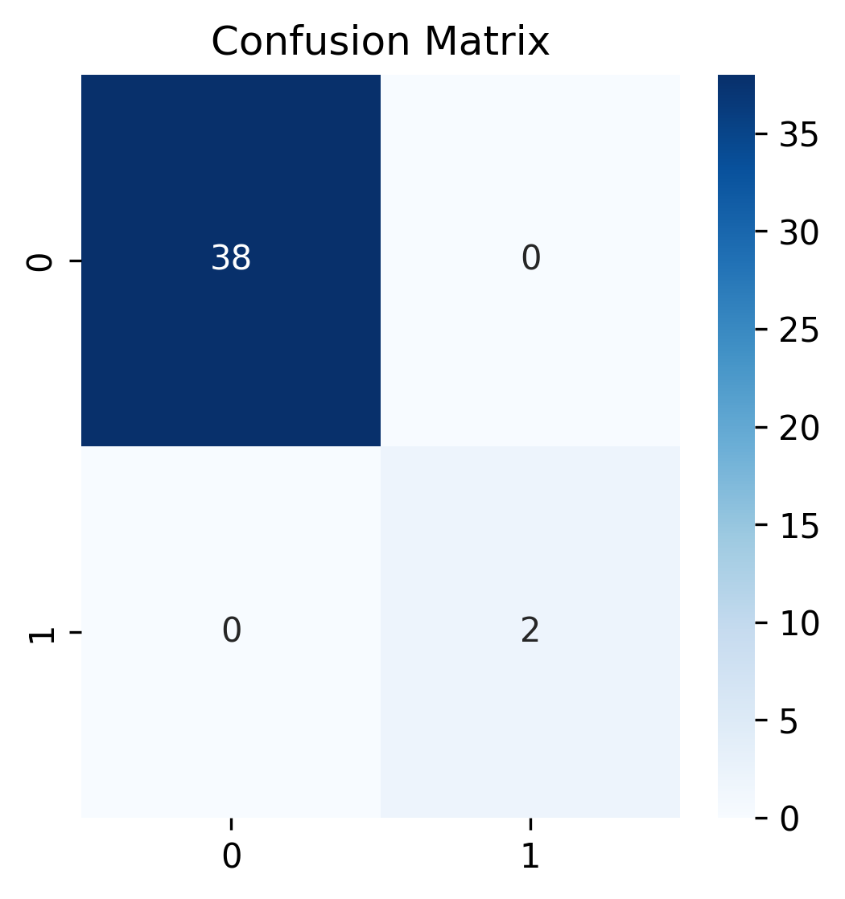
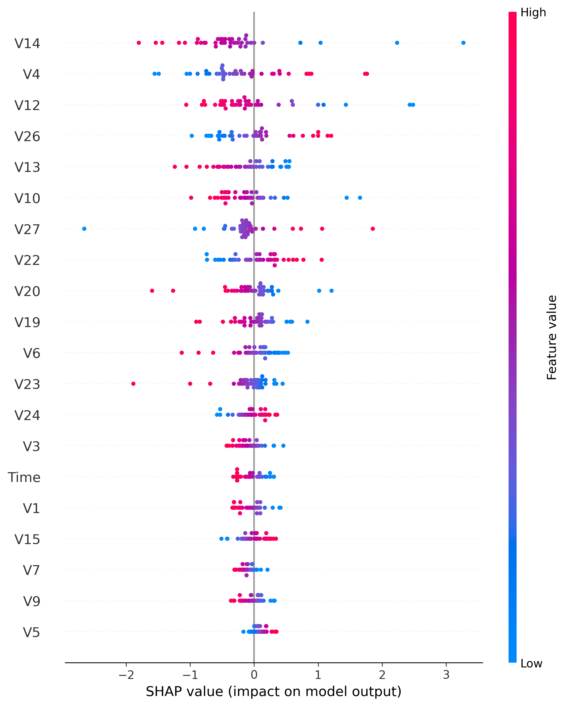
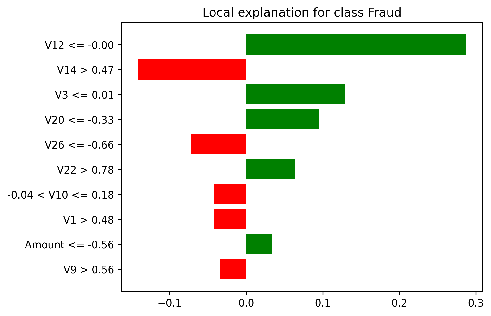

# fraud-interpretability
SHAP and LIME interpretability analysis on financial fraud detection dataset

This project demonstrates **interpretable machine learning** on the [Credit Card Fraud Detection dataset](https://www.kaggle.com/mlg-ulb/creditcardfraud).  
It focuses on building a baseline model and applying interpretability tools (**SHAP** and **LIME**) to understand model predictions.

---

## Dataset
- **Sample dataset (`sample_creditcard.csv`)**:  
  - 200 rows (20 fraud, 180 non-fraud) included in this repo  
  - Lightweight and runs instantly in Colab / GitHub  

- **Full dataset (`creditcard.csv`)**:  
  - 284,807 rows, available on [Kaggle](https://www.kaggle.com/datasets/mlg-ulb/creditcardfraud)  

---

## Methods
1. **Data Preprocessing**  
   - StandardScaler for feature normalization  
   - Train-test split (80/20)  

2. **Baseline Model**  
   - Logistic Regression (with `class_weight="balanced"`)  
   - Evaluated using confusion matrix, precision, recall, F1-score  

3. **Model Interpretability**  
   - **SHAP (SHapley Additive Explanations)**: global + local feature importance  
   - **LIME (Local Interpretable Model-Agnostic Explanations)**: local explanations  

---

## Results

### Confusion Matrix

### SHAP Summary

### LIME Example
  

